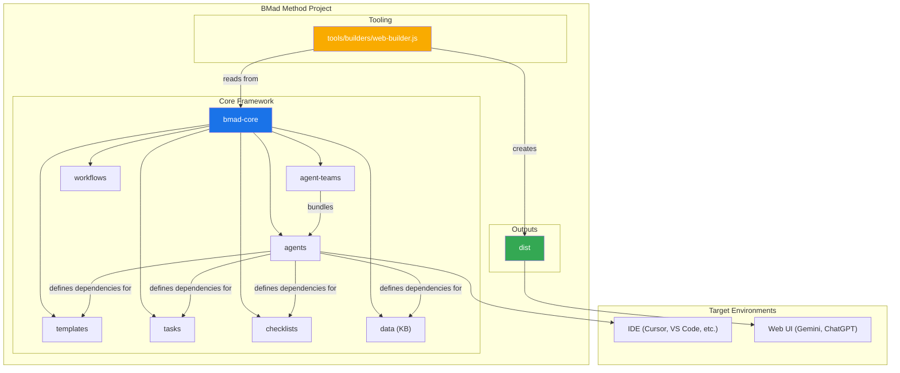
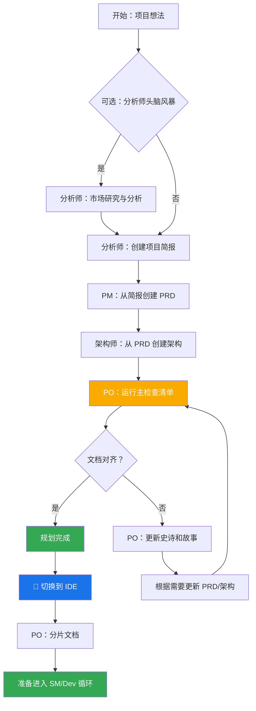
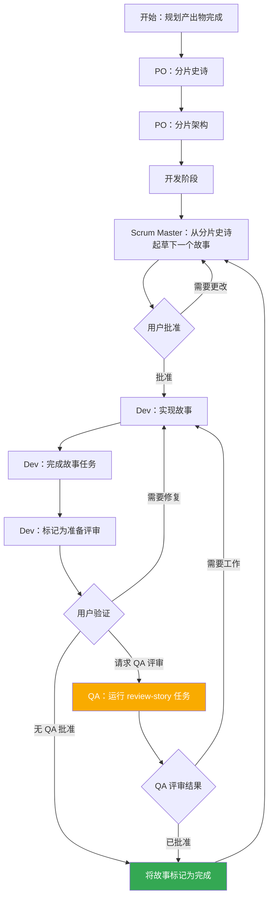

# BMad Method：核心架构

## 1. 概述

BMad Method 旨在提供智能体（Agent）模式、任务和模板，以允许可重复的有用工作流程，无论是敏捷智能体开发，还是扩展到截然不同的领域。该项目的核心目的是提供一套结构化且灵活的提示、模板和工作流程，用户可以使用它们来指导 AI 智能体（如 Gemini、Claude 或 ChatGPT）以可预测、高质量的方式执行复杂任务、引导讨论或其他有意义的领域特定流程。

系统核心模块促进了完整的开发生命周期，专为当前现代 AI 智能体工具的挑战而定制：

1. **构思和规划**：头脑风暴、市场研究和创建项目简报。
2. **架构和设计**：定义系统架构和 UI/UX 规格。
3. **开发执行**：一个循环工作流程，其中 Scrum Master（SM）智能体起草具有极其具体上下文的故事（Story），Developer（Dev）智能体逐一实现它们。此过程适用于新（绿地/Greenfield）和现有（棕地/Brownfield）项目。

## 2. 系统架构图

整个 BMad-Method 生态系统是围绕已安装的 `bmad-core` 目录设计的，它充当操作的大脑。`tools` 目录提供了为不同环境处理和打包这个大脑的手段。

## 3. 核心组件

`bmad-core` 目录包含所有给予智能体能力的定义和资源。

### 3.1. 智能体（`bmad-core/agents/`）

- **目的**：这些是系统的基础构建块。每个 markdown 文件（例如，`bmad-master.md`、`pm.md`、`dev.md`）定义单个 AI 智能体的角色、能力和依赖关系。
- **结构**：智能体文件包含一个 YAML 标头，指定其角色、角色设定、依赖关系和启动指令。这些依赖关系是智能体被允许使用的任务、模板、检查清单和数据文件的列表。
- **启动指令**：智能体可以包括从 `docs/` 文件夹加载项目特定文档的启动序列，例如编码标准、API 规格或项目结构文档。这在激活时提供即时的项目上下文。
- **文档集成**：智能体可以在任务、工作流程或启动序列中引用和加载项目 `docs/` 文件夹中的文档。用户也可以直接将文档拖入聊天界面以提供额外的上下文。
- **示例**：`bmad-master` 智能体列出其依赖关系，这告诉构建工具在 web 包中包含哪些文件，并告知智能体自己的能力。

### 3.2. 智能体团队（`bmad-core/agent-teams/`）

- **目的**：团队文件（例如，`team-all.yaml`）定义了为特定目的（如"全栈开发"或"仅后端"）捆绑在一起的智能体和工作流程集合。这为 web UI 环境创建了一个更大的、预打包的上下文。
- **结构**：团队文件列出要包含的智能体。它可以使用通配符，如 `"*"` 来包含所有智能体。这允许创建像 `team-all` 这样的综合捆绑包。

### 3.3. 工作流程（`bmad-core/workflows/`）

- **目的**：工作流程是 YAML 文件（例如，`greenfield-fullstack.yaml`），定义特定项目类型的规定步骤序列和智能体交互。它们充当用户和 `bmad-orchestrator` 智能体的战略指南。
- **结构**：工作流程定义复杂和简单项目的序列，列出每个步骤涉及的智能体、它们创建的产出物，以及从一个步骤移到下一个步骤的条件。它通常包括用于可视化的 Mermaid 图。

### 3.4. 可重用资源（`templates`、`tasks`、`checklists`、`data`）

- **目的**：这些文件夹容纳基于依赖关系由智能体动态加载的模块化组件。
  - **`templates/`**：包含常见文档的 markdown 模板，如 PRD、架构规格和用户故事。
  - **`tasks/`**：定义执行特定、可重复操作的说明，如"shard-doc"或"create-next-story"。
  - **`checklists/`**：为 Product Owner（`po`）或 Architect 等智能体提供质量保证检查清单。
  - **`data/`**：包含核心知识库（`bmad-kb.md`）、技术偏好（`technical-preferences.md`）和其他关键数据文件。

#### 3.4.1. 模板处理系统

BMad 的一个关键架构原则是模板是自包含和交互式的 - 它们嵌入了所需的文档输出和与用户协作所需的 LLM 指令。这意味着在许多情况下，不需要单独的任务来创建文档，因为模板本身包含所有处理逻辑。

BMad 框架采用由三个关键组件编排的复杂模板处理系统：

- **`template-format.md`**（`bmad-core/utils/`）：定义在所有 BMad 模板中使用的基础标记语言。此规范建立变量替换（`{{placeholders}}`）、仅 AI 处理指令（`[[LLM: instructions]]`）和条件逻辑块的语法规则。模板遵循此格式以确保系统中的一致处理。

- **`create-doc.md`**（`bmad-core/tasks/`）：充当管理整个文档生成工作流程的编排引擎。此任务协调模板选择，管理用户交互模式（增量 vs 快速生成），强制执行模板格式处理规则，并处理验证。它作为用户和模板系统之间的主要接口。

- **`advanced-elicitation.md`**（`bmad-core/tasks/`）：提供可通过 `[[LLM: instructions]]` 块嵌入模板中的交互式细化层。此组件提供 10 个结构化头脑风暴操作、逐节审查能力和迭代改进工作流程以增强内容质量。

系统维护清洁的关注点分离：模板标记由 AI 智能体内部处理但从不暴露给用户，同时通过模板本身内嵌入的智能提供复杂的 AI 处理能力。

#### 3.4.2. 技术偏好系统

BMad 通过 `bmad-core/data/` 中的 `technical-preferences.md` 文件包含个性化层。此文件作为影响所有项目中智能体行为的持久技术配置文件。

**目的和好处：**

- **一致性**：确保所有智能体引用相同的技术偏好
- **效率**：消除重复指定首选技术的需要
- **个性化**：智能体提供与用户偏好对齐的建议
- **学习**：捕获随时间演变的经验教训和偏好

**内容结构：**
文件通常包括首选技术栈、设计模式、外部服务、编码标准和要避免的反模式。智能体在规划和开发期间自动引用此文件以提供上下文适当的建议。

**集成点：**

- 模板可以在文档生成期间引用技术偏好
- 当适合项目需求时，智能体建议首选技术
- 当偏好不适合项目需求时，智能体解释替代方案
- Web 包可以包含偏好内容以在跨平台中保持一致行为

**随时间演变：**
鼓励用户使用项目发现持续更新此文件，添加积极偏好和要避免的技术，创建随时间改善智能体建议的个性化知识库。

## 4. 构建和交付过程

该框架设计用于两个主要环境：本地 IDE 和基于 web 的 AI 聊天界面。`web-builder.js` 脚本是支持后者的关键。

### 4.1. Web 构建器（`tools/builders/web-builder.js`）

- **目的**：这个 Node.js 脚本负责创建在 `dist` 中找到的 `.txt` 包。
- **过程**：
  1. **解析依赖关系**：对于给定的智能体或团队，脚本读取其定义文件。
  2. 它递归查找智能体/团队需要的所有依赖资源（任务、模板等）。
  3. **捆绑内容**：它读取所有这些文件的内容并将它们连接成一个大的文本文件，用明确的分隔符指示每个部分的原始文件路径。
  4. **输出包**：最终的 `.txt` 文件保存在 `dist` 目录中，准备上传到 web UI。

### 4.2. 特定环境使用

- **对于 IDE**：用户通过 `bmad-core/agents/` 中的 markdown 文件直接与智能体交互。IDE 集成（对于 Cursor、Claude Code 等）知道如何调用这些智能体。
- **对于 Web UI**：用户从 `dist` 上传预构建的包。这个单一文件为 AI 提供整个团队及其所有必需工具和知识的上下文。

## 5. BMad 工作流程

### 5.1. 规划工作流程

在开发开始之前，BMad 遵循结构化的规划工作流程，为成功的项目执行奠定基础：

**关键规划阶段：**

1. **可选分析**：分析师进行市场研究和竞争分析
2. **项目简报**：由分析师或用户创建的基础文档
3. **PRD 创建**：PM 将简报转换为综合产品需求
4. **架构设计**：架构师基于 PRD 创建技术基础
5. **验证和对齐**：PO 确保所有文档一致和完整
6. **细化**：根据需要更新史诗、故事和文档
7. **环境转换**：从 web UI 到 IDE 开发工作流程的关键切换
8. **文档准备**：PO 为开发消费分片大文档

**工作流程编排**：`bmad-orchestrator` 智能体使用这些工作流程定义来指导用户完成整个过程，确保规划（web UI）和开发（IDE）阶段之间的适当转换。

### 5.2. 核心开发循环

一旦初始规划和架构阶段完成，项目进入循环开发工作流程，如 `bmad-kb.md` 中详述。这确保了稳定、顺序和质量控制的实现过程。

此循环继续，Scrum Master、Developer 和可选的 QA 智能体协同工作。QA 智能体通过 `review-story` 任务提供高级开发者评审能力，提供代码重构、质量改进和知识转移。这确保了高代码质量，同时保持开发速度。
