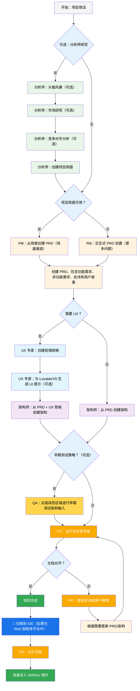
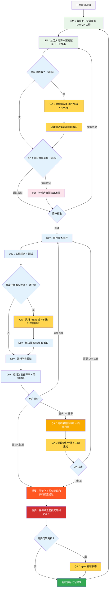

# BMad Method — 用户指南

本指南将帮助您理解和有效使用 BMad Method 进行敏捷 AI 驱动的规划和开发。

## BMad 规划和执行工作流程

首先，这里是完整的标准绿地规划 + 执行工作流程。棕地项目非常相似，但建议先理解这个绿地流程，即使是在一个简单的项目上，再处理棕地项目。BMad Method 需要安装到新项目文件夹的根目录。对于规划阶段，您可以选择使用强大的 Web 智能体，可能以极低的成本获得更高质量的结果，相比提供自己的 API 密钥或在某些智能工具中使用积分。对于规划，强大的思考模型和更大的上下文 - 以及与智能体合作 - 将获得最佳结果。

如果您要在棕地项目（现有项目）中使用 BMad Method，请查看 **[在棕地中工作](./working-in-the-brownfield.md)**。

如果下面的图表无法渲染，请安装 Markdown All in One 以及 Markdown Preview Mermaid Support 插件到 VSCode（或其分叉版本）。使用这些插件，当打开标签时右键点击，应该有一个打开预览选项，或查看 IDE 文档。

### 规划工作流程（Web UI 或强大的 IDE 智能体）

在开发开始之前，BMad 遵循一个结构化的规划工作流程，理想情况下在 Web UI 中完成以提高成本效率：



#### Web UI 到 IDE 转换

**关键转换点**：一旦 PO 确认文档对齐，您必须从 Web UI 切换到 IDE 开始开发工作流程：

1. **将文档复制到项目**：确保 `docs/prd.md` 和 `docs/architecture.md` 在您项目的文档文件夹中（或安装期间可以指定的自定义位置）
2. **切换到 IDE**：在您首选的智能 IDE 中打开项目
3. **文档分片**：使用 PO 智能体分片 PRD，然后分片架构
4. **开始开发**：启动随后的核心开发循环

#### 规划产出物（标准路径）

```text
PRD              → docs/prd.md
架构文档         → docs/architecture.md
分片史诗         → docs/epics/
分片用户故事     → docs/stories/
QA 评估          → docs/qa/assessments/
QA 门禁          → docs/qa/gates/
```

### 核心开发循环（IDE）

规划完成且文档分片后，BMad 遵循结构化的开发工作流程：



## 先决条件

安装 BMad Method 之前，确保您具备：

- **Node.js** ≥ 18, **npm** ≥ 9
- **Git** 已安装并配置
- **（可选）** VS Code 带有 "Markdown All in One" + "Markdown Preview Mermaid Support" 扩展

## 安装

### 可选

如果您想在 Web 上使用 Claude（Sonnet 4 或 Opus）、Gemini Gem（2.5 Pro）或自定义 GPT 进行规划：

1. 导航到 `dist/teams/`
2. 复制 `team-fullstack.txt`
3. 创建新的 Gemini Gem 或 CustomGPT
4. 上传文件并设置说明："您的关键操作说明已附加，请按指示不要打破角色扮演"
5. 输入 `/help` 查看可用命令

### IDE 项目设置

```bash
# 交互式安装（推荐）
npx bmad-method install
```

### Codex（CLI 和 Web）

BMAD 通过 `AGENTS.md` 和已提交的核心智能体文件与 OpenAI Codex 集成。

- 两种安装模式：
  - Codex（仅本地）：保持 `.bmad-core/` 被忽略以用于本地开发。
    - `npx bmad-method install -f -i codex -d .`
  - Codex Web 启用：确保 `.bmad-core/` 被跟踪，以便您可以将其提交到 Codex Web。
    - `npx bmad-method install -f -i codex-web -d .`

- 生成内容：
  - 在项目根目录的 `AGENTS.md`，包含 BMAD 部分：
    - Codex（CLI 和 Web）使用方法
    - 智能体目录（标题、ID、何时使用）
    - 详细的每个智能体部分，包含源路径、何时使用、激活短语和 YAML
    - 带有快速使用说明的任务
  - 如果存在 `package.json`，会添加有用的脚本：
    - `bmad:refresh`、`bmad:list`、`bmad:validate`

- 使用 Codex：
  - CLI：在项目根目录运行 `codex` 并自然提示，例如 "作为开发者，实现..."。
  - Web：提交 `.bmad-core/` 和 `AGENTS.md`，然后在 Codex 中打开仓库并以相同方式提示。

- 更改后刷新：
  - 重新运行相应的安装模式（`codex` 或 `codex-web`）以更新 `AGENTS.md` 中的 BMAD 块。

## 特殊智能体

有两个 BMad 智能体 — 将来它们将合并为单个 BMad-Master。

### BMad-Master

此智能体可以执行所有其他智能体能够执行的任务或命令，除了实际的故事实现。此外，该智能体可以在 Web 上通过访问知识库来帮助解释 BMad Method，并向您解释有关流程的任何内容。

如果您不想在除了开发者之外的不同智能体之间切换，这个智能体适合您。请记住，随着上下文增长，智能体的性能会下降，因此重要的是指示智能体压缩对话并以压缩后的对话作为初始消息开始新对话。经常这样做，最好在每个故事实现后进行。

### BMad-Orchestrator

此智能体不应在 IDE 中使用，它是一个重量级的、特殊用途的智能体，使用大量上下文并可以变形为任何其他智能体。这仅用于促进 Web 包中的团队。如果您使用 Web 包，您将受到 BMad Orchestrator 的欢迎。

### 智能体如何工作

#### 依赖系统

每个智能体都有一个定义其依赖关系的 YAML 部分：

```yaml
dependencies:
  templates:
    - prd-template.md
    - user-story-template.md
  tasks:
    - create-doc.md
    - shard-doc.md
  data:
    - bmad-kb.md
```

**要点：**

- 智能体只加载它们需要的资源（精简上下文）
- 依赖关系在打包期间自动解析
- 资源在智能体间共享以保持一致性

#### 智能体交互

**在 IDE 中：**

```bash
# 某些 IDE，如 Cursor 或 Windsurf 等，利用手动规则，因此使用 '@' 符号进行交互
@pm 为任务管理应用创建 PRD
@architect 设计系统架构
@dev 实现用户认证

# 某些 IDE，如 Claude Code，改为使用斜杠命令
/pm 创建用户故事
/dev 修复登录错误
```

#### 交互模式

- **增量模式**：逐步进行，需要用户输入
- **YOLO 模式**：快速生成，最小交互

## IDE 集成

### IDE 最佳实践

- **上下文管理**：仅保留相关文件在上下文中，保持文件精简和专注
- **智能体选择**：为任务使用适当的智能体
- **迭代开发**：在小而专注的任务中工作
- **文件组织**：维护清洁的项目结构
- **定期提交**：经常保存您的工作

## 测试架构师（QA 智能体）

### 概述

BMad 中的 QA 智能体不仅仅是"高级开发者评审员" - 它是一个具有测试策略、质量门禁和基于风险的测试深度专业知识的**测试架构师**。名为 Quinn，这个智能体在质量问题上提供咨询权威，同时在安全时主动改进代码。

#### 快速开始（基本命令）

```bash
@qa *risk {story}       # 开发前评估风险
@qa *design {story}     # 创建测试策略
@qa *trace {story}      # 开发期间验证测试覆盖率
@qa *nfr {story}        # 检查质量属性
@qa *review {story}     # 全面评估 → 写入门禁
```

#### 命令别名（测试架构师）

文档为方便起见使用简短形式。两种风格都有效：

```text
*risk    → *risk-profile
*design  → *test-design
*nfr     → *nfr-assess
*trace   → *trace-requirements（或只是 *trace）
*review  → *review
*gate    → *gate
```

### 核心能力

#### 1. 风险分析（`*risk`）

**时机：** 故事草稿后，开发开始前（最早干预点）

识别和评估实现风险：

- **类别**：技术、安全、性能、数据、业务、运营
- **评分**：概率 × 影响分析（1-9 分）
- **缓解**：每个已识别风险的具体策略
- **门禁影响**：风险 ≥9 触发失败，≥6 触发关注（权威规则请参见 `tasks/risk-profile.md`）

#### 2. 测试设计（`*design`）

**时机：** 故事草稿后，开发开始前（指导要编写什么测试）

创建全面的测试策略，包括：

- 每个验收标准的测试场景
- 适当的测试级别建议（单元 vs 集成 vs E2E）
- 基于风险的优先级（P0/P1/P2）
- 测试数据需求和模拟策略
- CI/CD 集成的执行策略

**示例输出：**

```yaml
test_summary:
  total: 24
  by_level:
    unit: 15
    integration: 7
    e2e: 2
  by_priority:
    P0: 8 # 必须有 - 链接到关键风险
    P1: 10 # 应该有 - 中等风险
    P2: 6 # 很好有 - 低风险
```

#### 3. 需求追踪（`*trace`）

**时机：** 开发期间（中期实现检查点）

将需求映射到测试覆盖率：

- 记录哪些测试验证每个验收标准
- 使用 Given-When-Then 以提高清晰度（仅文档，非 BDD 代码）
- 用严重性评级识别覆盖率缺口
- 为审计目的创建可追溯性矩阵

#### 4. NFR 评估（`*nfr`）

**时机：** 开发期间或早期审查（验证质量属性）

验证非功能需求：

- **核心四项**：安全性、性能、可靠性、可维护性
- **基于证据**：寻找实际实现证明
- **门禁集成**：NFR 失败直接影响质量门禁

#### 5. 综合测试架构评审（`*review`）

**时机：** 开发完成后，故事标记为"准备评审"

当您运行 `@qa *review {story}` 时，Quinn 执行：

- **需求可追溯性**：将每个验收标准映射到其验证测试
- **测试级别分析**：确保在单元、集成和 E2E 级别进行适当测试
- **覆盖率评估**：识别缺口和冗余测试覆盖率
- **主动重构**：在安全时直接改进代码质量
- **质量门禁决定**：根据发现发布通过/关注/失败状态

#### 6. 质量门禁（`*gate`）

**时机：** 评审修复后或需要更新门禁状态时

管理质量门禁决定：

- **确定性规则**：通过/关注/失败的明确标准
- **并行权威**：QA 拥有 `docs/qa/gates/` 中的门禁文件
- **咨询性质**：提供建议，不阻塞
- **豁免支持**：需要时记录接受的风险

**注意：** 门禁是咨询性的；团队选择他们的质量标准。豁免需要原因、批准者和到期日期。架构和评分请参见 `templates/qa-gate-tmpl.yaml`，门禁规则请参见 `tasks/review-story.md`，评分请参见 `tasks/risk-profile.md`。

### 与测试架构师合作

#### 与 BMad 工作流程的集成

测试架构师在整个开发生命周期中提供价值。以下是何时以及如何利用每个能力：

| **阶段**     | **命令**  | **何时使用**  | **价值**           | **输出**                                                       |
| ------------ | --------- | ------------- | ------------------ | -------------------------------------------------------------- |
| **故事起草** | `*risk`   | SM 起草故事后 | 及早识别陷阱       | `docs/qa/assessments/{epic}.{story}-risk-{YYYYMMDD}.md`        |
|              | `*design` | 风险评估后    | 指导开发者测试策略 | `docs/qa/assessments/{epic}.{story}-test-design-{YYYYMMDD}.md` |
| **开发**     | `*trace`  | 实现中期      | 验证测试覆盖率     | `docs/qa/assessments/{epic}.{story}-trace-{YYYYMMDD}.md`       |
|              | `*nfr`    | 构建功能时    | 及早发现质量问题   | `docs/qa/assessments/{epic}.{story}-nfr-{YYYYMMDD}.md`         |
| **评审**     | `*review` | 故事标记完成  | 全面质量评估       | 故事中的 QA 结果 + 门禁文件                                    |
| **评审后**   | `*gate`   | 修复问题后    | 更新质量决定       | 更新的 `docs/qa/gates/{epic}.{story}-{slug}.yml`               |

#### 示例命令

```bash
# 规划阶段 - 在开发开始前运行这些
@qa *risk {draft-story}     # 可能出现什么问题？
@qa *design {draft-story}   # 我们应该写什么测试？

# 开发阶段 - 在编码期间运行这些
@qa *trace {story}          # 我们测试了所有内容吗？
@qa *nfr {story}            # 我们满足质量标准吗？

# 评审阶段 - 开发完成时运行
@qa *review {story}         # 综合评估 + 重构

# 评审后 - 解决问题后运行
@qa *gate {story}           # 更新门禁状态
```

### 执行的质量标准

Quinn 执行这些测试质量原则：

- **无不稳定测试**：通过适当的异步处理确保可靠性
- **无硬等待**：仅使用动态等待策略
- **无状态且并行安全**：测试独立运行
- **自清理**：测试管理自己的测试数据
- **适当的测试级别**：逻辑用单元测试，交互用集成测试，E2E 用于用户旅程
- **明确断言**：在测试中保留断言，而不是辅助工具

### 门禁状态含义

- **通过**：满足所有关键要求，无阻塞问题
- **关注**：发现非关键问题，团队应审查
- **失败**：应解决的关键问题（安全风险、缺失 P0 测试）
- **豁免**：团队明确接受的已确认问题

### 特殊情况

**高风险故事：**

- 在开发开始前始终运行 `*risk` 和 `*design`
- 考虑开发中期的 `*trace` 和 `*nfr` 检查点

**复杂集成：**

- 开发期间运行 `*trace` 以确保所有集成点都经过测试
- 跟进 `*nfr` 以验证集成间性能

**性能关键：**

- 在开发期间及早且经常运行 `*nfr`
- 不要等到评审才发现性能问题

**棕地/遗留代码：**

- 从 `*risk` 开始识别回归危险
- 使用 `*review` 特别关注向后兼容性

### 最佳实践

- **早期参与**：在故事起草期间运行 `*design` 和 `*risk`
- **基于风险的关注**：让风险评分驱动测试优先级
- **迭代改进**：使用 QA 反馈改进未来故事
- **门禁透明度**：与团队分享门禁决定
- **持续学习**：QA 为团队知识共享记录模式
- **棕地关注**：在现有系统中特别注意回归风险

### 输出路径参考

测试架构师输出存储位置的快速参考：

```text
*risk-profile  → docs/qa/assessments/{epic}.{story}-risk-{YYYYMMDD}.md
*test-design   → docs/qa/assessments/{epic}.{story}-test-design-{YYYYMMDD}.md
*trace         → docs/qa/assessments/{epic}.{story}-trace-{YYYYMMDD}.md
*nfr-assess    → docs/qa/assessments/{epic}.{story}-nfr-{YYYYMMDD}.md
*review        → 故事中的 QA 结果部分 + 门禁文件引用
*gate          → docs/qa/gates/{epic}.{story}-{slug}.yml
```

## 技术偏好系统

BMad 通过位于 `.bmad-core/data/` 的 `technical-preferences.md` 文件包含个性化系统 - 这可以帮助偏向 PM 和架构师推荐您对设计模式、技术选择或您想要放在这里的任何其他内容的偏好。

### 与 Web 包一起使用

创建自定义 Web 包或上传到 AI 平台时，包含您的 `technical-preferences.md` 内容以确保智能体从任何对话开始就有您的偏好。

## 核心配置

`bmad-core/core-config.yaml` 文件是一个关键配置，使 BMad 能够与不同的项目结构无缝工作，未来将提供更多选项。目前最重要的是 yaml 中的 devLoadAlwaysFiles 列表部分。

### 开发者上下文文件

定义开发智能体应始终加载的文件：

```yaml
devLoadAlwaysFiles:
  - docs/architecture/coding-standards.md
  - docs/architecture/tech-stack.md
  - docs/architecture/project-structure.md
```

您需要从分片架构中验证这些文档存在，它们尽可能精简，并包含您希望开发智能体始终加载到其上下文中的确切信息。这些是智能体将遵循的规则。

随着项目增长和代码开始构建一致的模式，编码标准应该减少到只包含智能体仍需要强制执行的标准。智能体将查看文件中的周围代码以推断与当前任务相关的编码标准。

## 获得帮助

- **Discord 社区**：[加入 Discord](https://discord.gg/gk8jAdXWmj)
- **GitHub Issues**：[报告错误](https://github.com/bmadcode/bmad-method/issues)
- **文档**：[浏览文档](https://github.com/bmadcode/bmad-method/docs)
- **YouTube**：[BMadCode 频道](https://www.youtube.com/@BMadCode)

## 结论

记住：BMad 旨在增强您的开发流程，而不是取代您的专业知识。将其用作强大的工具来加速您的项目，同时保持对设计决策和实现细节的控制。
